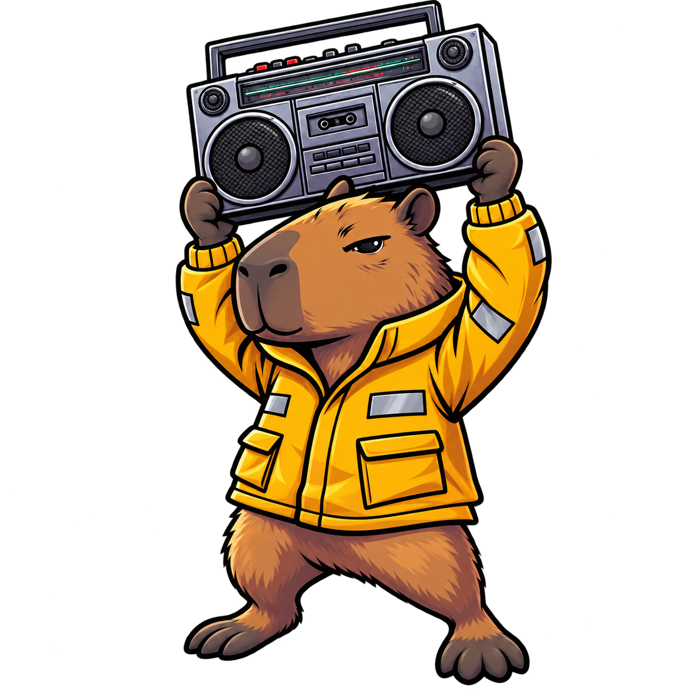
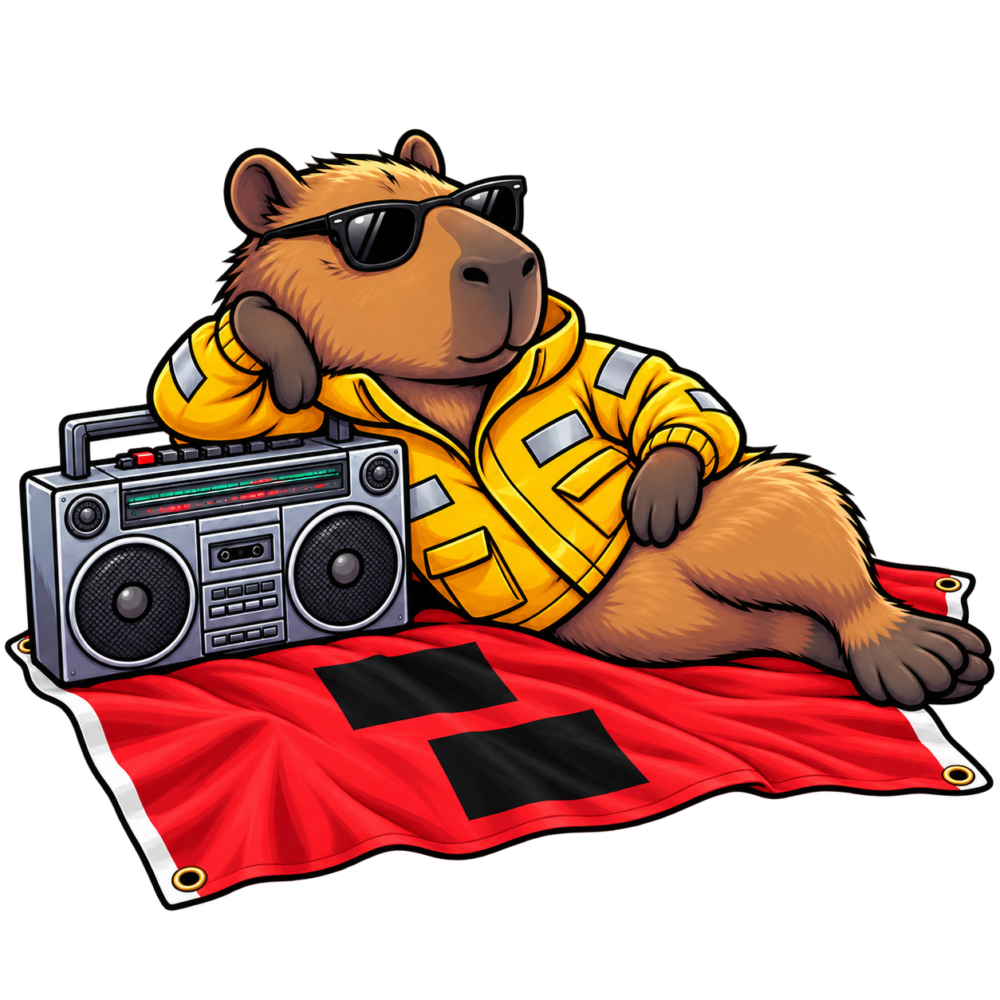

<p align="center">
  
</p>

# hurricane-party

Offline-first media library and player. Save YouTube playlists, videos, and MP3s to disk
so they're watchable when the internet is down during a hurricane. Classic Winamp-style
skinnable windows that magnetize to each other.

Windows-first. Tauri v2 + Svelte 5 + Vite. SQLite. yt-dlp, ffmpeg, and deno as sidecars.

**Personal tool, not a product.** Built for one engineer riding out hurricane season.

---

## Read this first

`docs/decisions.md` is the decision log and it is **authoritative**. When anything
contradicts it, the other thing is wrong or stale. Start there, then `CLAUDE.md` for
working conventions and the workflow.

## Getting set up

Windows PowerShell 5.1, the one every Windows install has, is enough. `pwsh` is not
required anywhere in this repo.

```powershell
powershell -NoProfile -ExecutionPolicy Bypass -File tools\check-prereqs.ps1    # what is missing, and installs the git hooks
powershell -NoProfile -ExecutionPolicy Bypass -File tools\fetch-sidecars.ps1   # ~230 MB, pinned versions, gitignored
pnpm install
pnpm tauri dev
```

`check-prereqs.ps1` reports every tool the build needs and where to get it. It also sets
`core.hooksPath` to `tools/git-hooks`, which refuses a direct push to `main`: main moves
only by merging a pull request on GitHub.

`fetch-sidecars.ps1` populates `src-tauri/binaries/` with the three bundled helpers.
Versions are **pinned deliberately** (O11) — a surprise yt-dlp bump the day before a
storm is the wrong failure. Bump them on purpose, test, then commit the new pin.

| Sidecar | Why | Decision |
|---|---|---|
| `yt-dlp` | The only extractor, ever | D2, D47 |
| `deno` | JS runtime for yt-dlp's EJS challenges | D46 |
| `ffmpeg` | MP3 extraction and cover art | D3, D48 |

### Getting a build without the toolchain

**To use it:** the download page, [paperhurts.github.io/hurricane-party](https://paperhurts.github.io/hurricane-party/),
or straight to the [latest release](https://github.com/paperhurts/hurricane-party/releases/latest).
The zip is the exe and its three sidecars; unzip anywhere and run `hurricane-party.exe`.
Windows 11 already has the WebView2 runtime. The first run trips SmartScreen because the
exe is not signed: *More info*, then *Run anyway*.

**To test a branch:** the `release-exe` workflow (Actions tab → *Run workflow* on the
branch) builds the same zip and uploads it as an artifact, which needs a GitHub login
and expires after 14 days. Pushing a `v*` tag runs it too and publishes the result as a
Release with the stable asset name the download page links to (#66).

## Commands

```sh
pnpm tauri dev                                              # run it
pnpm check                                                  # svelte-check + tsc
pnpm test                                                   # vitest: the frontend's pure logic (analyser math)
powershell -NoProfile -ExecutionPolicy Bypass -File tools\shot.ps1 -Match main   # screenshot a running window into .sid/
powershell -NoProfile -ExecutionPolicy Bypass -File tools\keyout.ps1 -In art.jpg -Out icon.png   # flat background -> transparent square PNG, then: pnpm tauri icon icon.png
pnpm tauri build --no-bundle                                # release binary, no installer

cargo test --manifest-path src-tauri/Cargo.toml --lib               # app tests
cargo test --manifest-path crates/hp-control/Cargo.toml             # protocol tests
cargo clippy --manifest-path src-tauri/Cargo.toml --all-targets     # lint; warnings are errors
cargo clippy --manifest-path crates/hp-control/Cargo.toml --all-targets
cargo fmt --manifest-path src-tauri/Cargo.toml --check              # format check; CI runs this
```

## Workflow

Say what you want. The session branches off `main`, builds it, and opens a pull request;
the owner hand-tests anything that shows on a screen and merges on GitHub. Issues are the
list of work that isn't happening yet. CI runs the gates above on every PR. Details, and
the two remaining Claude Code commands, are in `CLAUDE.md`.

## Layout

| Path | What |
|---|---|
| `src/` | Svelte frontend. One HTML entry point per OS window — `index.html`, `main.html`, `eq.html`, `playlist.html`, `video.html` |
| `src-tauri/` | Rust core: window engine, pipeline, job queue, SQLite, control server |
| `crates/hp-control/` | The public control protocol. Unstable until v1.0 |
| `docs/` | Specs. `decisions.md` wins over everything |
| `design/screens/` | Claude Design prototypes. **Visual reference only** — the prototype is not the spec |
| `tools/` | Prerequisite check, sidecar fetch, git hooks, control-pipe harness, screenshot and real-input helpers, icon background remover |
| `design/icon/` | The capybara. Icon source and README art |
| `.github/` | CI, the on-demand release build, issue and PR templates |
| `.claude/` | Claude Code skills, hooks, and agents for the workflow in `CLAUDE.md` |
| `.sid/` | Scratch screenshots, gitignored |

Data lives in `%APPDATA%\dev.paperhurts.hurricane-party\` — `hurricane-party.db` and
`library/`. Deleting that directory is a clean reset.

## Where the project is

| | |
|---|---|
| v0.0 | Window engine spike. All six stages passed, bond model is **GO** (D45). `bond.rs` was ported byte-identical and now evolves under its own tests (D66); the spike repo is archived |
| v0.1 | URL → MP3 → list → plays |
| v0.2 | SQLite, persistent queue with byte-level resume, playlists |
| v0.3 | Video window, local folder import, control API handshake + transport |
| v0.4a | The window system: bonding, splitter, shade modes, grouped z-order, layout persistence, stranded-group rescue |
| **v0.4b** | **In progress.** Chrome from tokens (D72), Main plays with the analyser on the radar ramp, 10-band EQ, the playlist window, seams that glow and discharge, 2x chrome, the playlist's corner grip, an oscilloscope, the viz stream on its own pipe (`hello` advertises `viz`; measured in `docs/control-api.md`), the windowshade as a mini-player. Left: the sprite renderer, which waits on the sheet. See `docs/v0.4-brief.md` and the v0.4b milestone on GitHub |

The canonical milestone table is in `docs/decisions.md` (D27).

## Things that are not negotiable

Short version; `CLAUDE.md` has the full list.

- **Zero network at playback time.** Enforced by CSP, not by policy (D29)
- **Dark only.** Bright themes exist; a light *mode* does not
- **The job queue survives hard power loss.** SQLite WAL (D10)
- **No in-process plugin loader.** The control API is the only external surface (D8)
- **Never hardcode a color.** Import `design/tokens.json`
- **yt-dlp is the only extractor.** No custom scrapers, ever

<p align="center">
  
  <br>
  <sub>Hurricane warning. The music is already downloaded.</sub>
</p>
